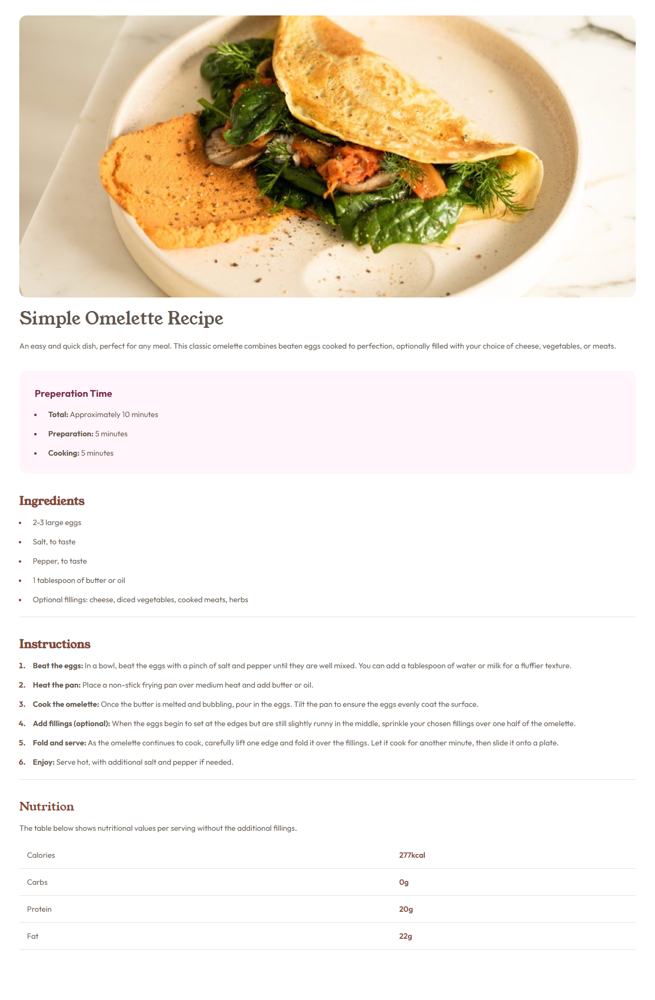

# Frontend Mentor - Recipe page solution

## Table of contents

- [Screenshot](#screenshot)
- [Links](#links)
- [Built with](#built-with)
- [Author](#author)
 

## Screenshot

## Links

- Solution URL: https://github.com/Suleman615/BWF-Project-01
- Live Site URL: https://simple-omelette.vercel.app/

## Built with

- Semantic HTML5 markup
- CSS custom properties
- Mobile-first workflow
- Tailwind CSS- For styles

## Author

- Frontend Mentor -(https://www.frontendmentor.io/profile/Suleman615)
- LinkedIn - (https://www.linkedin.com/in/ghulam-suleman)

